# GTS HRMS

A full-stack Human Resource Management System built on the MERN stack — attendance, leave, payroll, expenses, inventory, documents and task management in one place, with role-based access for six distinct roles.

<p align="left">
  
  
  
  
  
  
</p>

---

## Screenshots

### Task board
Every assignee shares one status — drag a card to another column and it moves for the whole team. Stat tiles, priority badges and overdue highlighting update live.

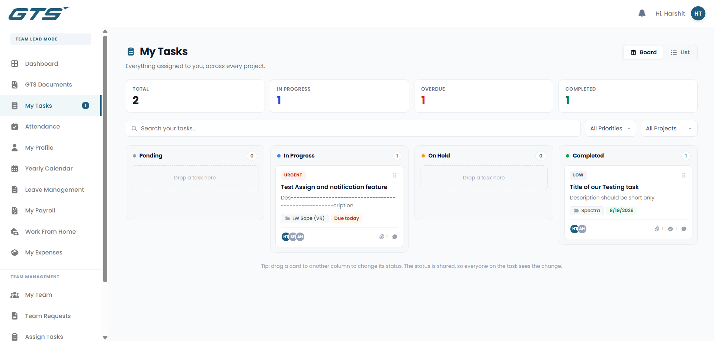

### Admin dashboard
Company-wide overview with headcount, live attendance and pending actions.

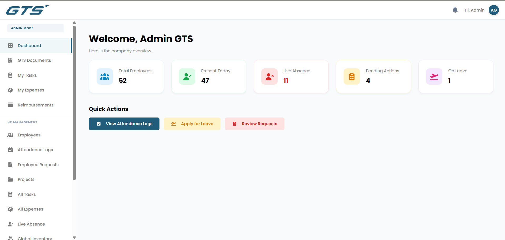

### Financial analytics
Expense analytics scoped to project or office spend, with category and source breakdowns.

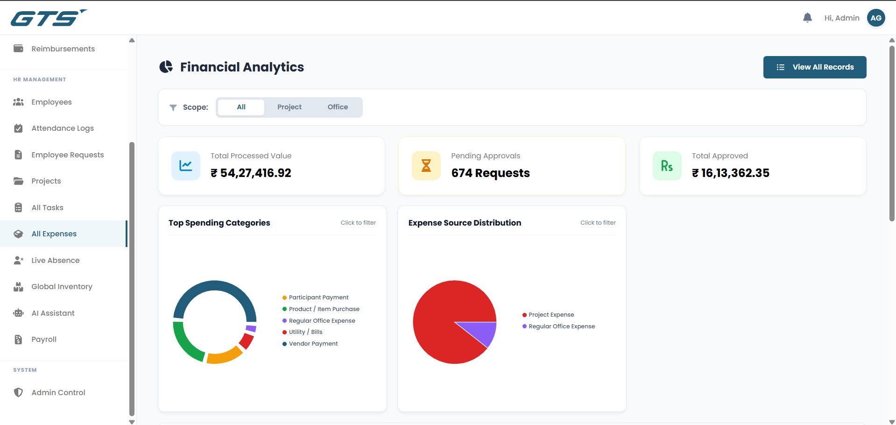

---

### Admin & HR

<table>
  <tr>
    <td width="50%">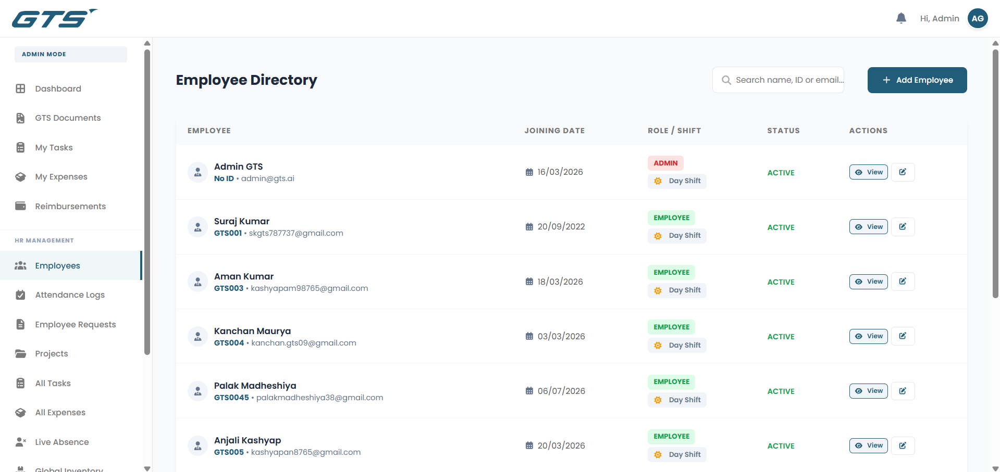<br><em>Employee directory</em></td>
    <td width="50%">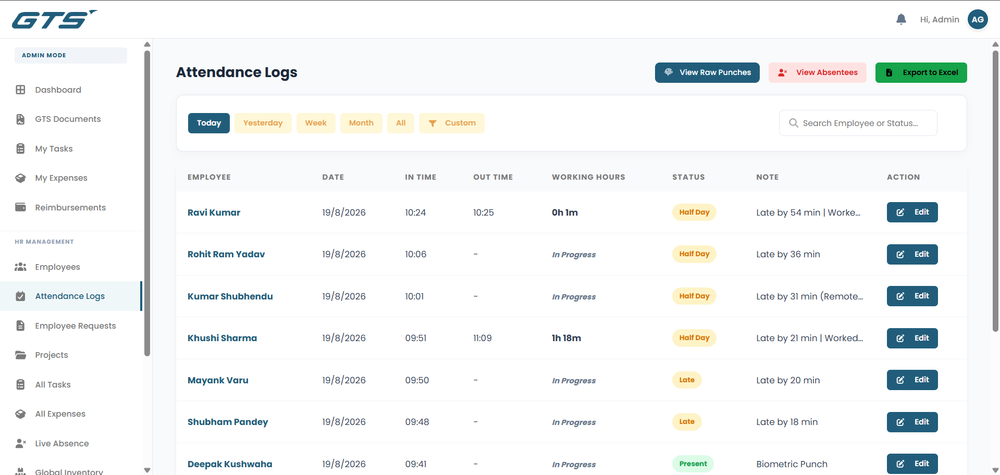<br><em>Attendance logs — shift-aware, exportable</em></td>
  </tr>
  <tr>
    <td width="50%">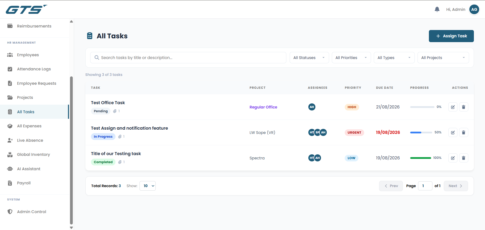<br><em>All tasks — filter by status, priority, type</em></td>
    <td width="50%">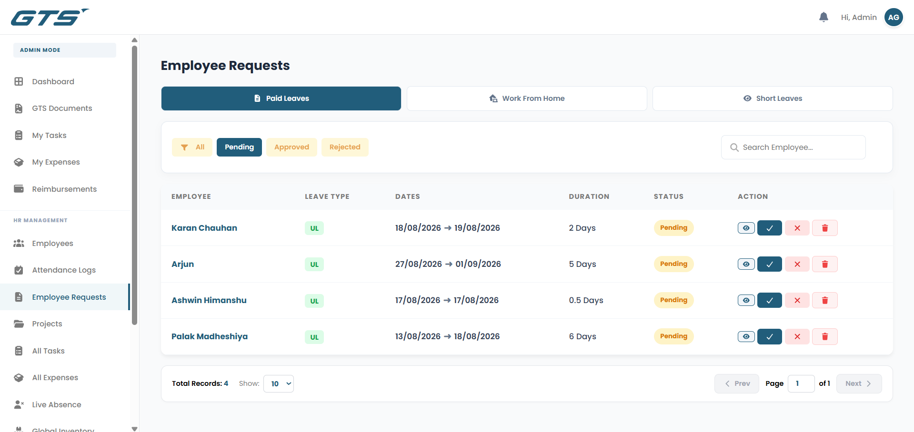<br><em>Leave &amp; WFH approvals</em></td>
  </tr>
  <tr>
    <td width="50%">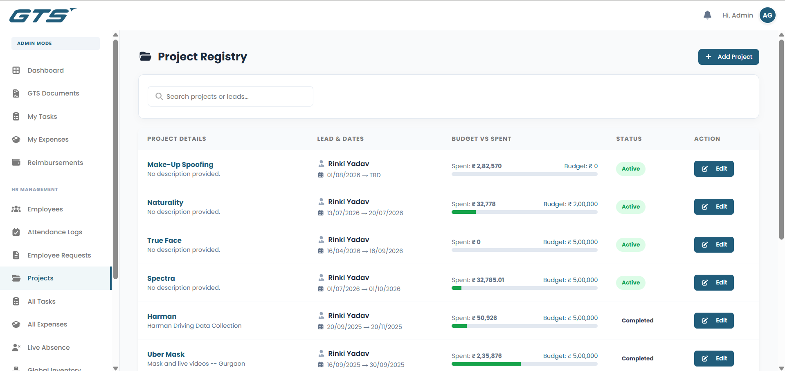<br><em>Projects with budget roll-ups</em></td>
    <td width="50%">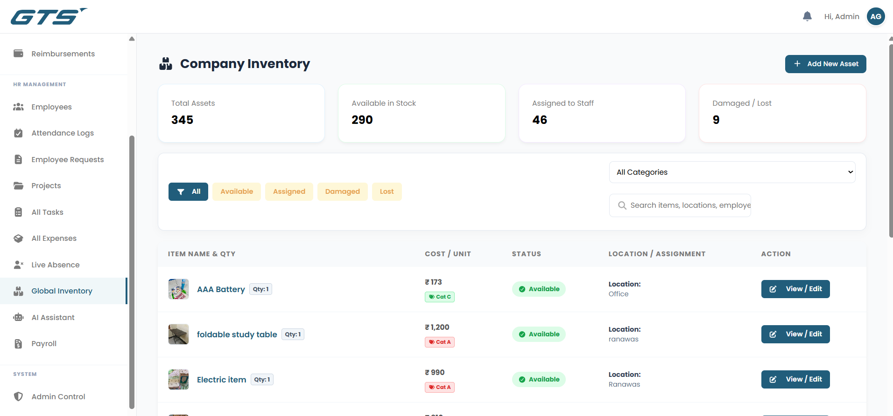<br><em>Global inventory</em></td>
  </tr>
  <tr>
    <td width="50%">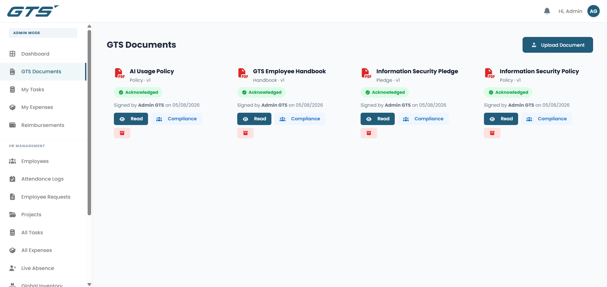<br><em>Policy documents with acknowledgement</em></td>
    <td width="50%">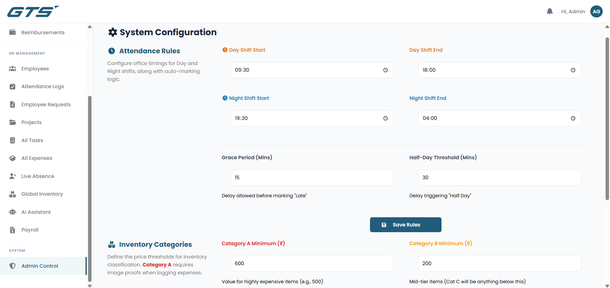<br><em>Admin control panel</em></td>
  </tr>
</table>

### Employee & Team Lead

<table>
  <tr>
    <td width="50%">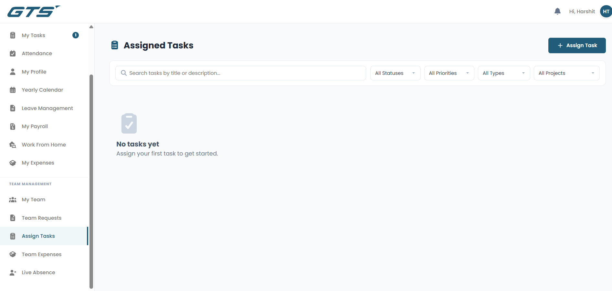<br><em>Assign a task — project or office work</em></td>
    <td width="50%">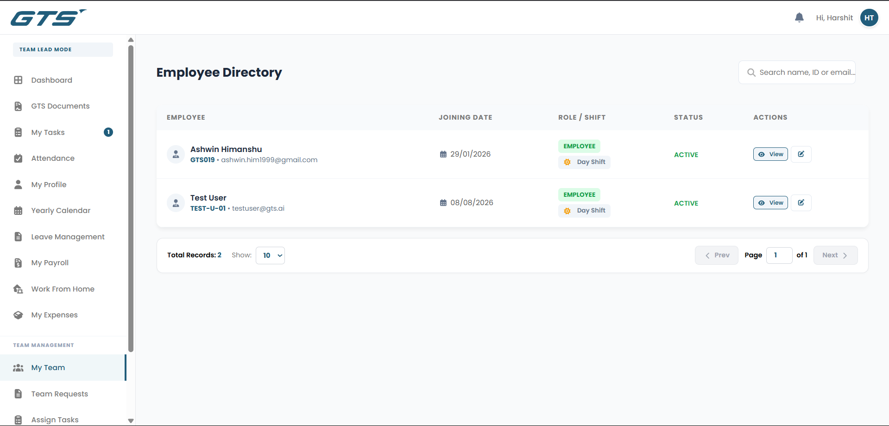<br><em>Team view, scoped to the lead</em></td>
  </tr>
  <tr>
    <td width="50%">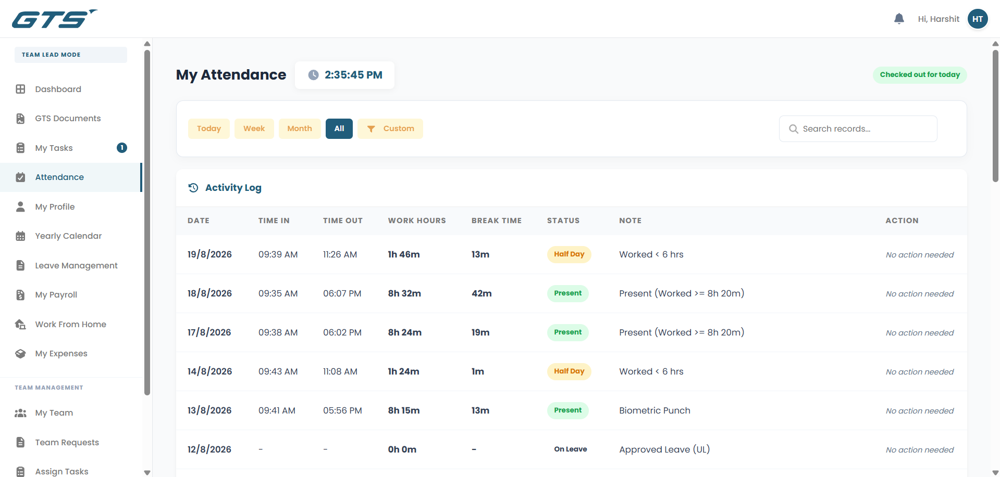<br><em>Personal attendance</em></td>
    <td width="50%">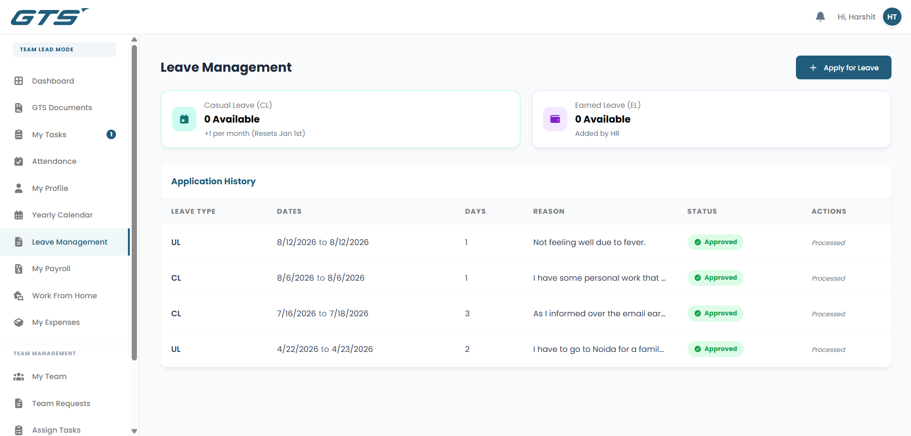<br><em>Leave balances &amp; history</em></td>
  </tr>
  <tr>
    <td width="50%">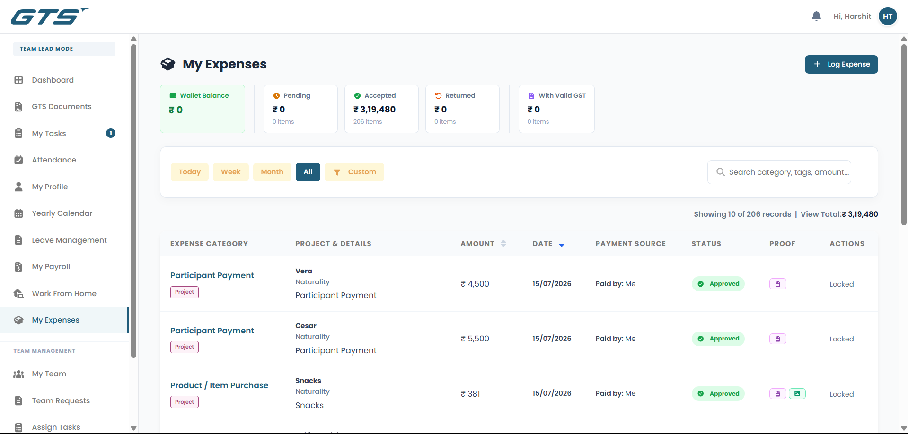<br><em>Personal expense claims</em></td>
    <td width="50%">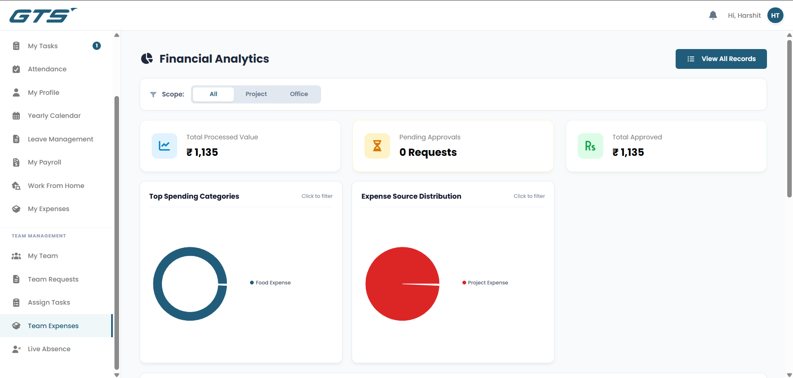<br><em>Team expenses</em></td>
  </tr>
  <tr>
    <td width="50%">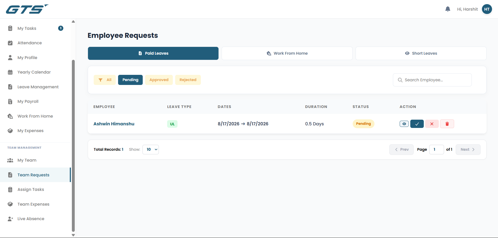<br><em>Team requests</em></td>
    <td width="50%">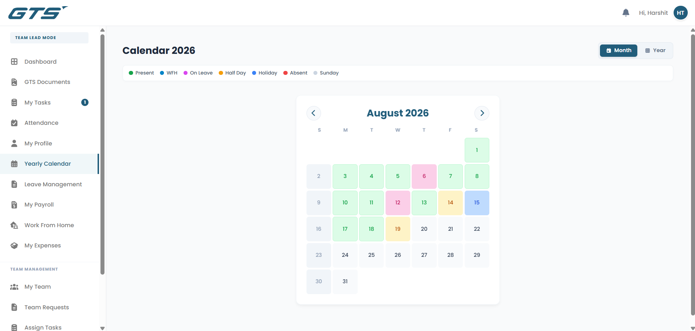<br><em>Yearly calendar &amp; holidays</em></td>
  </tr>
</table>

---

## Features

### People & time
- **Employee directory** with full profiles — job, contact, reporting manager and team lead chains
- **Attendance** with day/night shift handling, raw punch logs, live absence view, and cron jobs that pre-create shift records and sweep no-shows to Absent
- **Leave management** — casual and earned balances, half-days, approval flow with email actions
- **Work from home** requests with the same approval flow
- **Yearly calendar** and holiday management

### Money
- **Expenses** across 10+ categories with dynamic per-category fields, receipt and media upload, GST tracking, and merge/split of multi-item bills
- **Wallets & ledger** — per-employee balance with a full transaction history
- **Reimbursements** and **vendor** records
- **Payroll** with attendance-driven deductions, payslip generation and finalize/revert

### Operations
- **Projects** with budgets and spend roll-ups
- **Inventory** — assignable assets, auto-synced from approved purchases
- **Documents** — policy distribution with click-wrap acknowledgement, SHA-256 file hashing and versioning
- **AI assistant** backed by Google Gemini

### Task management
- Assign to **one person or several**, on a **project** or as **regular office work**
- **One shared status** per task (`Pending → In Progress → On Hold → Completed`) — whoever moves it, moves it for everyone
- **Kanban board** with drag-to-change-status, plus a list view
- **Live discussion thread** per task with image attachments
- **Reference media and completion proof**, including large video
- Priorities, due dates with overdue tracking, and a tasks tab on every employee profile

---

## Tech stack

| Layer | Technology |
|---|---|
| **Frontend** | React 18.3, React Router 7, Axios, Recharts, SweetAlert2, FontAwesome |
| **Backend** | Node.js 22, Express 5, Mongoose 9 |
| **Database** | MongoDB |
| **Realtime** | Socket.IO 4.8 |
| **Auth** | JWT (`jsonwebtoken`), bcryptjs |
| **Storage** | AWS S3 (`@aws-sdk/client-s3`) |
| **Media** | Sharp (images), FFmpeg via `fluent-ffmpeg` (video) |
| **Jobs** | node-cron |
| **Email** | Nodemailer |
| **AI** | Google Generative AI (Gemini) |
| **Spreadsheets** | ExcelJS, xlsx, csv-parser |

---

## Notable engineering

### Two-stage video pipeline
Task videos can be several hundred megabytes, and compressing them inline would make uploads crawl. Instead:

1. **On upload** the raw file is written to disk on the server and served immediately from `/uploads`, so it is watchable the moment it finishes uploading. A row is added to a compression queue.
2. **At midnight** a cron job transcodes each queued file with FFmpeg (H.264, max 1280px wide, CRF 28), uploads the result to S3, swaps the task's URL to the S3 link, and deletes the local original.

Real-world result: an 87.6 MB screen recording compressed to **2.6 MB (−97%)** in 31 seconds. Failures retry for up to three nights before being flagged, and a **catch-up sweep runs on startup** so a server restart spanning midnight doesn't strand a file.

### Realtime that isn't bolted on
Notification push lives in a `post('save')` hook on the `Notification` model rather than in route handlers — so *every* notification in the app is live, including leave, WFH and payroll, without those routes knowing sockets exist. Each client joins a private room keyed on its user ID; task pages additionally join a per-task room for discussion messages.

### Role-scoped data access
Six roles — `ADMIN`, `HR`, `MANAGER`, `TEAM LEAD`, `ACCOUNTS`, `EMPLOYEE` — with scoping enforced server-side, never merely hidden in the UI. A Team Lead can select any active project but may only assign work to their own team; a Manager can assign company-wide; an employee sees only their own records.

---

## Getting started

### Prerequisites
- Node.js 18+ (developed on 22.x)
- A MongoDB database (local or Atlas)
- An AWS S3 bucket and IAM credentials
- An SMTP account for outbound email

### Install

```bash
git clone https://github.com/me-harshit/mern-hrms.git
cd mern-hrms

cd server && npm install
cd ../client && npm install
```

### Configure

Create `server/.env`:

```env
PORT=5000
MONGO_URI=your_mongodb_connection_string
JWT_SECRET=your_jwt_secret

# Email
SMTP_HOST=
SMTP_PORT=
SMTP_USER=
SMTP_PASS=
SMTP_FROM=
HR_EMAIL=

# AWS S3
AWS_REGION=
AWS_ACCESS_KEY_ID=
AWS_SECRET_ACCESS_KEY=
AWS_S3_BUCKET_NAME=

# AI assistant
GEMINI_API_KEY=
```

> `.env` is gitignored. Never commit real credentials.

### Run

```bash
# Terminal 1 — API on :5000
cd server && npm start

# Terminal 2 — client on :3000
cd client && npm start
```

The client proxies to `http://localhost:5000` in development and to the same origin in production (`client/src/utils/api.js`).

### Notes for deployment
- **HTTPS is required** in production — several browser APIs used by the app refuse to run in an insecure context.
- `server/uploads/tasks/` needs enough free disk for a day's worth of raw video uploads; it is drained nightly.
- `@ffmpeg-installer/ffmpeg` downloads a platform-specific binary (~60–80 MB) at install time, so no system-wide FFmpeg is needed.

---

## Project structure

```
mern-hrms/
├── client/
│   └── src/
│       ├── components/     # Sidebar, Topbar, task discussion, media lightbox…
│       ├── pages/
│       │   ├── Admin/      # Management views
│       │   ├── User/       # Employee views
│       │   └── TaskDetail.js
│       ├── styles/
│       └── utils/          # axios instance, socket client, helpers
│
└── server/
    ├── cron/               # attendance + video compression jobs
    ├── middleware/         # auth, upload handling
    ├── models/             # 20 Mongoose schemas
    ├── routes/             # 20 API modules
    └── utils/              # S3, email, realtime, task media
```

---

## Roadmap

- In-browser screen recorder with microphone narration for task briefs and completion proof — planned in detail in [`TaskPlan.md`](TaskPlan.md) §12
- Due-date reminder notifications
- Mobile-friendly drag and drop on the task board

---

## License

Proprietary — built for internal use at GTS.
